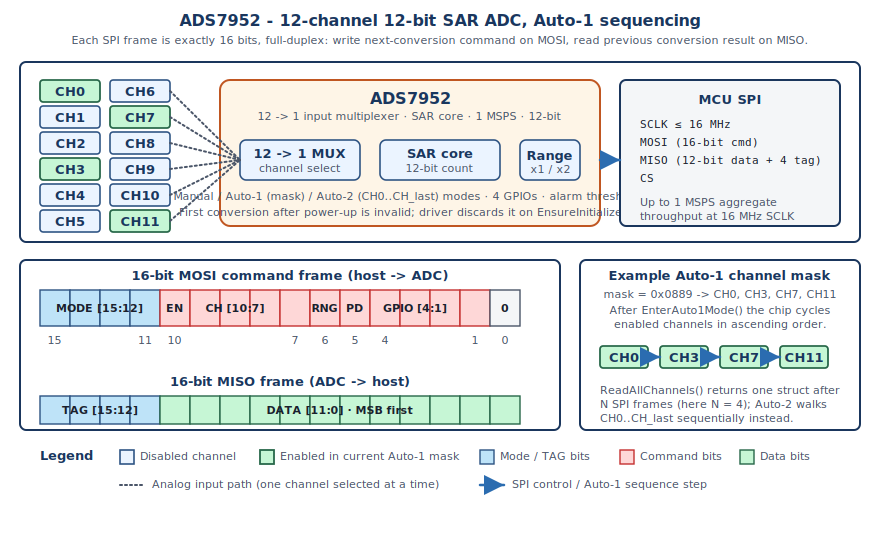

# HF-ADS7952 Driver

**Portable C++20 driver for the Texas Instruments ADS7952 12-channel, 12-bit SAR ADC with SPI interface**

[](https://en.cppreference.com/w/cpp/20)
[](https://www.gnu.org/licenses/gpl-3.0)
[](https://github.com/N3b3x/hf-ads7952-driver/actions/workflows/esp32-examples-build-ci.yml)
[](https://n3b3x.github.io/hf-ads7952-driver/)

## 📚 Table of Contents
1. [Overview](#-overview)
2. [Features](#-features)
3. [Quick Start](#-quick-start)
4. [Installation](#-installation)
5. [API Reference](#-api-reference)
6. [Examples](#-examples)
7. [Documentation](#-documentation)
8. [References](#-references)
9. [Contributing](#-contributing)
10. [License](#-license)

## 📦 Overview

> **📖 [📚🌐 Live Complete Documentation](https://n3b3x.github.io/hf-ads7952-driver/)** —
> Interactive guides, examples, and step-by-step tutorials

**HF-ADS7952** is a portable C++20 driver for the **ADS7952** 12-channel, 12-bit SAR ADC from Texas Instruments. It delivers up to 1 MSPS conversion rates over a 16-bit full-duplex SPI interface with support for manual channel selection, two auto-sequencing modes, configurable input range (Vref / 2×Vref), per-channel alarm thresholds, 4 GPIO pins with alarm routing, and power-down control.

Designed for the **HardFOC-V1** motor controller, it is equally suitable for any application requiring fast multi-channel ADC sampling — motor current sensing, temperature monitoring, battery management, or general-purpose data acquisition.

The driver uses a **CRTP-based** `SpiInterface` for hardware abstraction, allowing it to run on any platform (ESP32, STM32, Arduino, Linux spidev, etc.) with **zero runtime overhead**. All SPI frame sequences are datasheet-verified against **TI ADS79xx SLAS605C Rev C**.



## ✨ Features

- ✅ **12-channel, 12-bit** SAR ADC — up to 1 MSPS sampling rate
- ✅ **Manual mode** — select and read individual channels with 2-frame SPI pipeline
- ✅ **Auto-1 mode** — automatic sequencing through a programmable channel bitmask
- ✅ **Auto-2 mode** — sequential scan from CH0 through a programmable last channel
- ✅ **Configurable input range** — Vref (0–2.5 V) or 2×Vref (0–5.0 V), auto-clamped to VA
- ✅ **Per-channel alarm thresholds** — programmable high/low alarm limits per channel
- ✅ **4 GPIO pins** — configurable as outputs, inputs, alarm indicators, range/power-down control
- ✅ **Power-down control** — normal operation or device power-down
- ✅ **Voltage conversion** — raw 12-bit count to voltage (instance and static methods)
- ✅ **First-frame discard** — automatic handling of invalid power-up conversion per datasheet
- ✅ **Structured results** — `ReadResult` and `ChannelReadings` with built-in error checking
- ✅ **Hardware Agnostic** — CRTP SPI interface for platform independence
- ✅ **Modern C++20** — constexpr registers, enum classes, zero-overhead CRTP design
- ✅ **ESP-IDF Ready** — component wrapper, 4 examples, and 30+ integration tests included

## 🚀 Quick Start

```cpp
#include "ads7952.hpp"

// 1. Implement the SPI interface (see platform_integration.md)
class MySpi : public ads7952::SpiInterface<MySpi> {
    friend class ads7952::SpiInterface<MySpi>;
protected:
    void transfer(const uint8_t* tx, uint8_t* rx, size_t len) {
        // Your platform-specific SPI transfer
    }
};

// 2. Create driver instance (Vref = 2.5V, VA = 5.0V)
MySpi spi;
ads7952::ADS7952<MySpi> adc(spi, 2.5f, 5.0f);
adc.EnsureInitialized();  // Idempotent — discards first conversion, programs defaults, enters Auto-1

// 3. Read a single channel (Manual mode)
auto result = adc.ReadChannel(3);
if (result.ok()) {
    printf("CH3: %u counts (%.3f V)\n", result.count, result.voltage);
}

// 4. Read all channels (Auto-1 batch mode)
auto all = adc.ReadAllChannels();
if (all.ok()) {
    for (uint8_t ch = 0; ch < 12; ch++) {
        if (all.hasChannel(ch))
            printf("CH%u: %.3f V\n", ch, all.voltage[ch]);
    }
}
```

For detailed setup, see [Installation](docs/installation.md) and [Quick Start Guide](docs/quickstart.md).

## 🔧 Installation

1. **Clone or add as submodule** into your project
2. **Implement the SPI interface** for your platform (see [Platform Integration](docs/platform_integration.md))
3. **Include the header** in your code:
   ```cpp
   #include "ads7952.hpp"
   ```
4. Compile with a **C++20** or newer compiler

For detailed installation instructions, see [docs/installation.md](docs/installation.md).

## 📖 API Reference

### Core Operations

| Method | Description |
|--------|-------------|
| `EnsureInitialized()` | Idempotent init — programs defaults on first call, no-op after |
| `ReadChannel(ch)` | Read a single ADC channel → `ReadResult` with count, voltage, error |
| `ReadAllChannels()` | Read all Auto-1 channels → `ChannelReadings` with per-channel data |
| `CountToVoltage(count)` | Convert raw count using current active reference |
| `CountToVoltage(count, vref)` | Static conversion with explicit reference voltage |

### Mode Control

| Method | Description |
|--------|-------------|
| `EnterManualMode(ch)` | Switch to manual mode, selecting a channel |
| `EnterAuto1Mode(reset)` | Switch to Auto-1 sequencing mode |
| `EnterAuto2Mode(reset)` | Switch to Auto-2 sequencing mode |
| `GetMode()` | Get current operating mode |

### Programming

| Method | Description |
|--------|-------------|
| `ProgramAuto1Channels(mask)` | Set which channels Auto-1 sequences through |
| `ProgramAuto2LastChannel(ch)` | Set the last channel for Auto-2 sequential scan |
| `ProgramGPIO(config)` | Configure GPIO direction, alarm routing, special functions |
| `ProgramAlarm(ch, bound, threshold)` | Set a per-channel alarm threshold (high or low) |

### Configuration & Diagnostics

| Method | Description |
|--------|-------------|
| `SetRange(range)` | Set Vref or 2×Vref input range |
| `SetPowerDown(pd)` | Enter or exit power-down mode |
| `SetGPIOOutputs(state)` | Drive GPIO output pin levels |
| `GetVref()` / `GetActiveVref()` | Read reference voltages |
| `GetAuto1ChannelMask()` | Read programmed Auto-1 channel mask |
| `GetAuto2LastChannel()` | Read programmed Auto-2 last channel |

For complete API documentation, see [docs/api_reference.md](docs/api_reference.md).

## 📊 Examples

| Example | Description |
|---------|-------------|
| **[Basic ADC Reading](examples/esp32/main/basic_adc_reading_example.cpp)** | Initialize, manual reads, batch reads, voltage conversion |
| **[Multi-Mode](examples/esp32/main/multi_mode_example.cpp)** | Manual, Auto-1, Auto-2 modes with channel masks and range comparison |
| **[Alarm & GPIO](examples/esp32/main/alarm_gpio_example.cpp)** | GPIO outputs, alarm thresholds, alarm-as-output configuration |
| **[Integration Tests](examples/esp32/main/driver_integration_test.cpp)** | 30+ test cases across 9 sections with automatic pass/fail reporting |

For ESP32-S3 build instructions, see the [examples/esp32](examples/esp32/) directory.

Detailed example walkthroughs are available in [docs/examples.md](docs/examples.md).

## 📚 Documentation

Complete documentation is available in the [docs directory](docs/index.md):

| Guide | Description |
|-------|-------------|
| [🛠️ Installation](docs/installation.md) | Prerequisites, submodule setup, CMake integration |
| [⚡ Quick Start](docs/quickstart.md) | Minimal working example in under 20 lines |
| [🔌 Hardware Setup](docs/hardware_setup.md) | ADS7952 wiring, SPI config, power supply, decoupling |
| [🔧 Platform Integration](docs/platform_integration.md) | CRTP SPI interface for ESP32, STM32, Linux |
| [⚙️ Configuration](docs/configuration.md) | Kconfig, CMake defines, voltage references, channel masks |
| [📖 API Reference](docs/api_reference.md) | Complete method signatures, enums, structs, error codes |
| [💡 Examples](docs/examples.md) | Walkthrough of all 4 example applications |
| [🐛 Troubleshooting](docs/troubleshooting.md) | Error codes, SPI debugging, common hardware issues |
| [🔩 CMake Integration](docs/cmake_integration.md) | Build system setup, ESP-IDF component, FetchContent |

## 🔗 References

| Resource | Link |
|----------|------|
| TI ADS7952 product page | <https://www.ti.com/product/ADS7952> |
| TI ADS79xx datasheet (SLAS605C Rev C) | <https://www.ti.com/lit/ds/symlink/ads7952.pdf> |
| ESP-IDF SPI master | <https://docs.espressif.com/projects/esp-idf/en/stable/esp32/api-reference/peripherals/spi_master.html> |
| Linux spidev (Kernel docs) | <https://www.kernel.org/doc/html/latest/spi/spidev.html> |
| C++20 language reference | <https://en.cppreference.com/w/cpp/20> |

## 🤝 Contributing

Pull requests and suggestions are welcome! Please follow the existing code style and include tests for new features.

## 📄 License

This project is licensed under the **GNU General Public License v3.0**.
See the [LICENSE](LICENSE) file for details.
